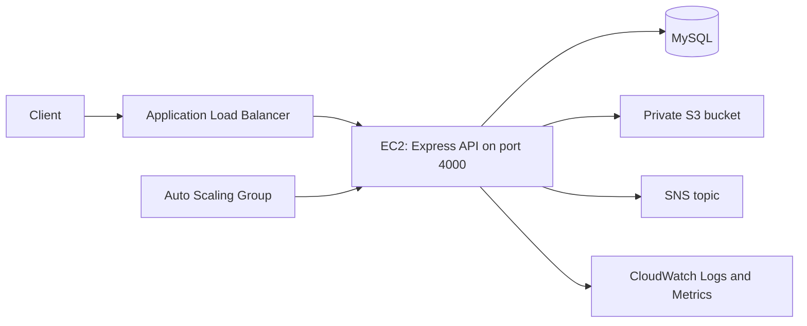

# Document Processing & Monitoring Platform

A Node.js and AWS practice project for authenticated document uploads, S3 storage, MySQL metadata, SNS notifications, and CloudWatch monitoring. The Express API listens on port `4000` by default and is designed to run behind an Application Load Balancer.

This guide describes the code currently in this repository. AWS resource names below come from the project handoff; verify them in the AWS account before changing or recreating anything.

## Architecture



The ALB forwards requests to healthy EC2 targets. The Auto Scaling Group manages those instances. MySQL should be reachable only from the application instances, and the S3 bucket should remain private.

## Request Flow

1. A client registers at `POST /api/auth/register` and signs in at `POST /api/auth/login`.
2. Login returns a JWT. Document routes require `Authorization: Bearer <token>`.
3. On upload, the API verifies the token, reads a multipart field named `document`, then checks the declared MIME type and file size.
4. The file is sent to S3 at `documents/user-<userId>/<original filename>`.
5. The API writes metadata to MySQL and publishes an SNS message. SNS failure is logged; it does not roll back the S3 object or database row.
6. CloudWatch log events and metrics are emitted, and the API returns HTTP `201` with document metadata.
7. Listing, reading, and deleting documents require authentication. The controller checks that the requested user or document belongs to the signed-in user.

## Repository Layout

```text
server.js                              Express app and route registration
src/config/dbConnect.js                MySQL connection pool
src/config/aws.config.js               S3 client
src/controllers/                       Authentication and document handlers
src/middleware/                        JWT, upload, and request metrics middleware
src/repository/document.repository.js  MySQL document queries
src/routes/                            Auth and document endpoints
src/services/                          S3, SNS, and CloudWatch integrations
loadTest.js                            k6 health endpoint scenario
```

## Requirements

- Node.js 22
- MySQL 8 or a compatible MySQL server
- AWS resources for S3, SNS, and CloudWatch
- k6, if you plan to run the load scenario

## Local Setup

Install dependencies:

```bash
npm install
```

Create a MySQL database and the tables queried by the repository. The user table needs `id`, `name`, `email`, and `password_hash`; the document table uses these fields:

```sql
CREATE TABLE users (
  id VARCHAR(36) PRIMARY KEY,
  name VARCHAR(255) NOT NULL,
  email VARCHAR(255) NOT NULL UNIQUE,
  password_hash VARCHAR(255) NOT NULL
);

CREATE TABLE documents (
  id VARCHAR(36) PRIMARY KEY,
  user_id VARCHAR(36) NOT NULL,
  original_name VARCHAR(255) NOT NULL,
  s3_key VARCHAR(1024) NOT NULL,
  s3_url TEXT NOT NULL,
  file_size BIGINT UNSIGNED NOT NULL,
  mime_type VARCHAR(127) NOT NULL,
  uploaded_at TIMESTAMP NOT NULL DEFAULT CURRENT_TIMESTAMP,
  INDEX idx_documents_user_uploaded (user_id, uploaded_at),
  CONSTRAINT fk_documents_user
    FOREIGN KEY (user_id) REFERENCES users(id)
    ON DELETE CASCADE
);
```

Create a `.env` file in the repository root. `.env` is ignored by Git. Keep real credentials there for local work and never commit the file.

```dotenv
SERVER_PORT=4000
JWT_SECRET=replace-with-a-long-random-value

DB_HOST=127.0.0.1
DB_PORT=3306
DB_USER=document_app
DB_PASSWORD=your_password
DB_NAME=document_platform

AWS_REGION=ap-south-1
AWS_S3_BUCKET=student-document-system-shubh-2026
AWS_SNS_TOPIC_ARN=replace-with-the-topic-arn
CLOUDWATCH_LOG_GROUP_NAME=document-system-monitoring

# The current AWS client configuration reads these values.
# Do not use long-lived access keys on EC2; see AWS Credentials below.
AWS_ACCESS_KEY_ID=replace-with-a-local-development-key
AWS_SECRET_ACCESS_KEY=replace-with-a-local-development-secret
```

The current source passes access-key environment variables to its S3, SNS, and CloudWatch clients. For local development, use a restricted IAM identity. Start the API with:

```bash
node server.js
```

`package.json` does not define a `start` script. The server listens on `SERVER_PORT` (default `4000`) and attempts a MySQL connection during startup. Check the console and call `/api/health` before using the API.

## API

| Method | Path | Purpose | Authentication |
| --- | --- | --- | --- |
| `POST` | `/api/auth/register` | Create an account | No |
| `POST` | `/api/auth/login` | Verify password and return a JWT | No |
| `POST` | `/api/documents/upload` | Upload one document | Bearer token |
| `GET` | `/api/documents/user/:userId` | List that user's documents | Bearer token; ID must match token |
| `GET` | `/api/documents/:id` | Return document metadata | Bearer token; owner only |
| `DELETE` | `/api/documents/:id` | Delete S3 object and metadata | Bearer token; owner only |
| `GET` | `/api/health` | Basic process health check | No |

The registration controller expects the caller to provide an `id`:

```json
{
  "id": "a-unique-user-id",
  "name": "Sam Example",
  "email": "sam@example.com",
  "password": "choose-a-password"
}
```

Login body:

```json
{
  "email": "sam@example.com",
  "password": "choose-a-password"
}
```

For upload, send `multipart/form-data` with a file field named `document`. The current middleware accepts the declared MIME types `application/pdf`, `image/jpeg`, and `image/png`, up to 5 MB. After login, use the returned `accessToken` as the bearer token on document requests.

`GET /api/documents/:id` returns metadata; it does not download the file. An S3 read helper exists, but no download route or pre-signed URL flow is wired up yet. `/api/ready` is not implemented, so the target group's health check should use `/api/health`.

## AWS Setup and Deployment

The handoff lists `ap-south-1`, bucket `student-document-system-shubh-2026`, SNS topic `document-notification-system`, log group `document-system-monitoring`, IAM role `EC2Role`, and launch template `document_template`. Confirm these resources in the account before using them.

1. **Database:** Create the database and tables above. Keep the database in a private network and allow its port only from the application security group.
2. **S3:** Enable Block Public Access and server-side encryption. Keep the bucket and its objects private. The app stores objects under a user-specific prefix.
3. **SNS and CloudWatch:** Create the SNS topic and log group. The app publishes metrics to the `DocumentPlatform` namespace. Grant only the S3, SNS publish, CloudWatch Logs, and CloudWatch metrics actions the application needs.
4. **EC2 credentials:** The intended deployment uses an instance role. As written, the source supplies explicit access keys to AWS SDK clients, so the clients will not automatically use `EC2Role`. Before relying on the role, update those clients to use the AWS SDK default credential provider chain and remove static keys from the instance environment.
5. **Launch Template:** Use Node.js 22, install dependencies, provide database/JWT configuration through a protected mechanism, and run the API on port `4000`.
6. **Process manager:** Install PM2 on the instance and start the application:

   ```bash
   pm2 start server.js --name document-platform
   pm2 save
   ```

   Configure PM2 startup for the instance operating system so the process returns after reboot.
7. **Target Group and ALB:** Forward traffic to port `4000` and use `/api/health` for target health checks. Allow inbound port `4000` on EC2 only from the ALB security group. Add an HTTPS listener and certificate for a public production endpoint; redirect HTTP to HTTPS where appropriate.
8. **Auto Scaling:** Create an Auto Scaling Group from the launch template and attach the target group. Choose minimum, desired, and maximum capacity for the workload. Use a measured CPU target-tracking policy and enable ELB health checks so unhealthy instances are replaced.
9. **Verify the path:** Check target health, open the ALB health URL, register and log in, upload a small allowed file, confirm its metadata in MySQL and object in S3, then check the SNS topic and CloudWatch logs/metrics.

The repository contains application code, not infrastructure templates. The ALB, target group, launch template, Auto Scaling Group, IAM role, dashboard, and alarms are configured separately in AWS. Dashboard panels and alarms for ALB traffic, latency, HTTP errors, EC2 CPU/network, upload failures, SNS failures, and unhealthy targets are deployment tasks; the source does not confirm that they already exist.

## Monitoring

CloudWatch Logs uses `CLOUDWATCH_LOG_GROUP_NAME` and a fixed stream named `document-platform-local`. The metrics service publishes into `DocumentPlatform`. Current metric names in the code are `requestCount`, `5xxErrorcount`, `DocumentsUploaded`, `DocumentsUploadFailed`, `SNSNotificationsSent`, and `SNSNotificationsFailed`. Metric calls are best-effort; failures are written to the application console.

Upload logs record the start, S3 result, database result, SNS result, and completion. Do not add passwords, JWTs, AWS credentials, or document contents to log messages.

## Load Check

`loadTest.js` targets the ALB health endpoint currently recorded in the file. Update the URL if the ALB DNS name changes. Its checked-in defaults are `5000` virtual users for one minute, so constrain the first run and increase gradually while watching ALB, EC2, application, and CloudWatch metrics:

```bash
k6 run --vus 1 --duration 30s loadTest.js
```

Do not run a high-concurrency scenario against a shared or production environment without an agreed test window and known capacity limit.

## Current Implementation Notes

These points describe the checked-in code; they are not claims that every assignment requirement is complete:

- Uploads use Multer memory storage and are limited to 5 MB. Validation checks the MIME type supplied with the request, not the file signature or extension.
- S3 keys use the original filename, not a generated UUID. The API returns an S3 URL but does not generate a pre-signed download URL.
- SNS publishing runs after the S3 and MySQL operations. A publish error is logged and counted, but there is no retry queue or recovery worker.
- If S3 succeeds and the MySQL insert fails, there is no cleanup or reconciliation step for the uploaded object.
- There is no auth/upload rate limiter, pagination, `/api/ready` endpoint, or automated test suite configured in `package.json`.
- The request metric middleware uses casing that differs from the assignment's required metric names. The metric list above reflects the source, not confirmation that all required dashboard metrics are present.

Update these notes as the implementation changes.
